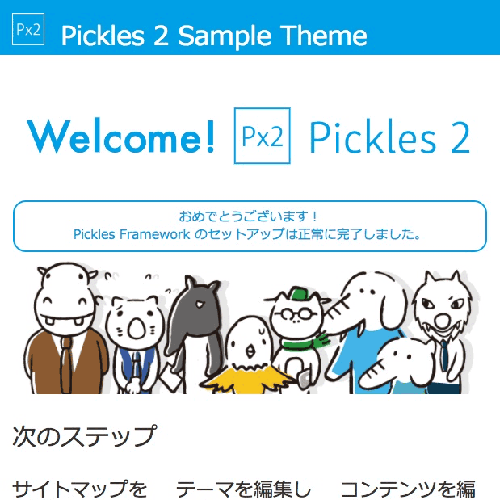

# px2-theme-pickles2-sample

[Pickles 2](http://pickles2.pxt.jp/) のためのサンプルテーマです。

<p style="text-align:center;"></p>

## セットアップ - Setup

### 1. [Pickles 2](http://pickles2.pxt.jp/) プロジェクトを[セットアップ](http://pickles2.pxt.jp/manual/setup/projects.html)

### 2. `composer.json` に、パッケージ情報を追加

```json
{
    "repositories": [
        {
            "type": "git",
            "url": "https://github.com/tomk79/px2-theme-pickles2-sample.git"
        }
    ],
    "require": {
        "tomk79/px2-theme-pickles2-sample": "dev-master"
    }
}
```

### 3. composer update

更新したパッケージ情報を反映します。

```
$ composer update
```

### 4. 新規テーマを作成してインポート

Pickles 2 アプリケーションを開き、テーマ編集から新規テーマを作成し、 `Pickles 2 Sample Theme` からインポートを選択します。


## ライセンス - License

Copyright (c)2001-2017 Tomoya Koyanagi, and Pickles 2 Project<br />
MIT License https://opensource.org/licenses/mit-license.php

## 作者 - Author

- Tomoya Koyanagi tomk79@gmail.com
- website: http://www.pxt.jp/
- Twitter: @tomk79 http://twitter.com/tomk79/
